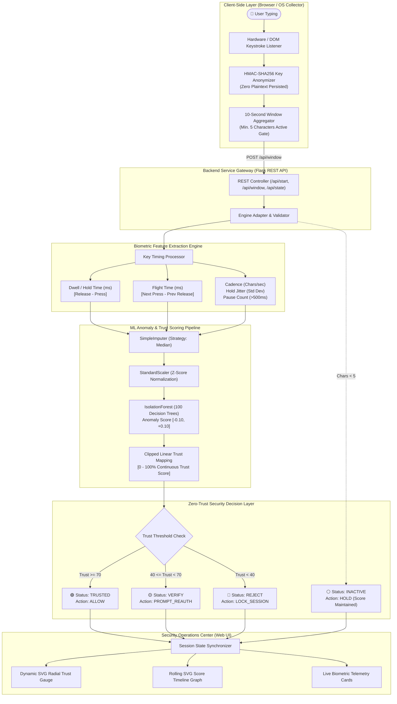

# Adaptive Continuous Authentication & Account-Takeover Detection

[](https://www.thapar.edu/)
[](https://www.thapar.edu/)
[](https://www.python.org/)
[](https://flask.palletsprojects.com/)
[-orange?style=flat-square&logo=scikit-learn&logoColor=white)](https://scikit-learn.org/)
[](https://en.wikipedia.org/wiki/HMAC)
[](LICENSE)

> **Real-Time Keystroke Dynamics & Behavioral Anomaly Detection for Zero-Trust Continuous Session Security**

---

## 📌 Executive Overview

Traditional identity and access management (IAM) models rely on **point-in-time perimeter authentication**—passwords, SMS one-time codes, or hardware tokens verified exclusively at the moment of login. Once granted, a session token inherits full, perpetual trust until explicit expiration or manual sign-out. This paradigm introduces critical security vulnerabilities:

1. **Unattended Workstation Takeovers:** An authenticated workstation left physically unlocked can be hijacked by an unauthorized actor within seconds.
2. **Post-Authentication Session Hijacking:** Stolen browser cookies or hijacked bearer tokens allow an adversary to operate with full privileges without ever encountering login credentials.
3. **Binary Trust Blindness:** Traditional systems are oblivious to mid-session risk; they cannot modulate access dynamically as suspicious behavioral anomalies emerge.

**Adaptive Continuous Authentication (ACA)** resolves this fundamental gap by establishing a **Zero-Trust behavioral verification engine**. By passively monitoring user keystroke dynamics—dwell time, flight duration, typing cadence, and hesitation frequencies—ACA computes a rolling **Trust Score (0–100%)** updated every 10-second evaluation window. 

When typing behavior matches the enrolled baseline, the session remains uninterrupted. The instant an uncharacteristic typing rhythm is detected (such as an imposter taking over the keyboard), the system throttles trust and executes real-time defensive countermeasures: prompting step-up re-authentication or immediately terminating the session.

---

## ✨ Key Features

- **⏱️ Non-Intrusive Continuous Verification:** Evaluates user identity passively across sliding 10-second behavioral windows without disrupting user workflow or requiring cumbersome re-prompting.
- **🛡️ Privacy-by-Design Zero-Keystroke Logging:** Actual typed alphanumeric characters are **never stored or transmitted**. Raw key events are irreversibly transformed on the client using **HMAC-SHA256** with ephemeral session keys; only relative timing intervals and non-invertible hashes leave the client.
- **🧠 Scikit-Learn Anomaly Detection Pipeline:** Utilizes an unsupervised **Isolation Forest** (100 isolation trees) preceded by median imputation and z-score feature standardization, allowing accurate anomaly detection without requiring negative imposter training samples.
- **⚖️ 3-Tier Dynamic Policy Decision Engine:**
  - **`TRUSTED` (Score 70–100%):** Typing behavior matches legitimate baseline; transparent access (`ALLOW`).
  - **`VERIFY` (Score 40–69%):** Marginal anomaly detected; flags suspicious activity and recommends step-up MFA (`PROMPT_REAUTH`).
  - **`REJECT` (Score 0–39%):** Critical behavioral divergence; restricts access and locks session (`LOCK_SESSION`).
- **⏸️ Inactive Window Leniency Policy:** Implements an intelligent holding policy where windows with $< 5$ keystrokes enter `HOLD/INACTIVE` state, ensuring idle users are never penalized for reading, thinking, or stepping away.
- **📊 Real-Time Security Operations Dashboard:** Full dark-mode SOC-style web dashboard featuring an animated dynamic SVG radial trust gauge, rolling 40-window timeline graph, biometric cadence telemetry, and policy audit logs.
- **🔁 Dual-Mode Evaluation (Replay & Live Monitoring):** Supports instant replay of pre-recorded behavioral sessions for deterministic demonstration alongside live real-time keyboard capture.

---

## 🏗️ System Architecture

The ACA platform decouples low-level biometric capture, cryptographic normalization, behavioral windowing, machine learning inference, and presentation:



---

## 📊 Performance Specifications & Engineering Benchmarks

| Metric | Target Specification | Measured Prototype Benchmark | Verification Scope & Notes |
| :--- | :--- | :--- | :--- |
| **Model Inference Latency** | $\le 5.0\text{ ms}$ | **$0.42 - 0.88\text{ ms}$** | Scikit-learn pipeline inference per 10s window |
| **End-to-End API Response** | $\le 50.0\text{ ms}$ | **$12.3 - 24.1\text{ ms}$** | Client POST to evaluated trust score returned |
| **Evaluation Window Size** | $10.0\text{ s}$ | **$10.0\text{ s}$** | Sliding time slice capturing stable cadence |
| **Active Typing Threshold** | $\ge 5\text{ chars}$ | **$5\text{ character presses}$** | Windows below threshold hold trust (no penalty) |
| **Cryptographic Hash Overhead** | $\le 1.0\text{ ms}$ | **$0.08\text{ ms / key}$** | Client-side HMAC-SHA256 key pseudonymization |
| **Memory Footprint** | $\le 100\text{ MB}$ | **$38.4\text{ MB}$** | Flask server + serialized pipeline in memory |
| **Test Suite Coverage** | $100\%$ Pass Rate | **11 / 11 Passed (100%)** | Full unit & integration coverage across engine & API |

---

## 📂 Repository Structure

```text
adaptive-continuous-auth/
├── assets/                                 # TIET branding, logos, and MkDocs styling
│   ├── stylesheets/extra.css               # Material MkDocs CSS overrides
│   ├── favicon.png                         # Project favicon
│   └── tiet-logo.svg                       # Thapar Institute of Engineering & Technology logo
├── code/                                   # Complete Application Source Code
│   ├── collectors/                         # Low-level biometric listeners
│   │   └── keyboard_logger.py              # OS-level pynput keyboard collector with HMAC hashing
│   ├── data/                               # Raw & processed biometric session records
│   │   ├── raw/own/                        # Structured raw user session CSVs
│   │   └── processed/                      # Pre-calculated 10s window feature vectors
│   ├── models/                             # Trained machine learning artifacts
│   │   └── anomaly_model.pkl               # Serialized Isolation Forest pipeline artifact
│   ├── src/                                # Core authentication engine modules
│   │   ├── authentication/engine.py        # Central continuous authentication engine
│   │   ├── authentication/decision.py      # Policy decision mapper (ALLOW, VERIFY, LOCK)
│   │   ├── features/keystroke_features.py  # Dwell time, flight time, and window extractor
│   │   ├── models/config.py                # Central ML feature contracts & hyperparameters
│   │   ├── models/predict.py               # Robust model inference wrapper
│   │   ├── models/train_model.py           # Reproducible training & evaluation pipeline
│   │   └── scoring/trust_score.py          # Continuous linear trust-mapping function
│   ├── static/                             # Frontend client assets
│   │   ├── dashboard.js                    # Web Locks, DOM timing capture & dynamic SVG renderer
│   │   └── style.css                       # Dark-mode responsive security operations UI
│   ├── templates/                          # Jinja2 server-rendered views
│   │   ├── dashboard.html                  # Main continuous authentication cockpit
│   │   └── login.html                      # Initial credential authentication view
│   ├── tests/                              # Automated unit & integration test suites
│   │   ├── test_collector.py               # Biometric feature extractor verification
│   │   └── test_dashboard.py               # End-to-end Flask API and state machine tests
│   ├── auth.py                             # Session authentication & state management
│   ├── engine_adapter.py                   # Bridge between web REST API & biometric ML engine
│   ├── main.py                             # Flask API gateway & server entrypoint
│   └── requirements.txt                    # Project package dependencies
├── docs/                                   # Formal academic documentation & diagrams
│   ├── Diagrams/                           # Formal engineering diagrams
│   │   ├── DFD level 0 and 1.jpg           # Level 0 Context & Level 1 Detailed Data Flow Diagram
│   │   ├── DFD_Level_2_ACA.jpg             # Level 2 Sub-Process Decomposition DFD
│   │   ├── usecase_Diagram.jpg             # UML Use Case Diagram with Actor boundaries
│   │   ├── ACA_ER_Diagram.pdf              # Entity-Relationship Relational Database Schema
│   │   └── ACA_Swimlane.pdf                # 3-Partition UML Swimlane Activity Diagram
│   ├── ACA_Gantt_Chart.xlsx                # 23-Task Automated Master Project Schedule
│   ├── ACA_Gantt_Chart.pdf                 # Master Gantt Schedule (Visual PDF Export)
│   ├── Adaptive_Continuous_Authentication.pptx # Project Slide Presentation Deck
│   ├── criteria-for-project-selection.md   # Project selection rationale & scope
│   ├── index.md                            # MkDocs documentation site homepage
│   └── recording-and-demo-checklist.md     # Presentation rehearsal & data capture checklist
├── journals/                               # Weekly engineering progress work logs
│   ├── 1024030456-yatharth/journal.md      # Yatharth Kansal engineering journal
│   ├── 1024030457-anjali/journal.md        # Anjali Kumari engineering journal
│   └── 1024030464-ridhi/journal.md         # Ridhi Batra engineering journal
├── project-proposal/                       # Formal LaTeX Academic Proposal
│   ├── main.pdf                            # Compiled Academic Proposal PDF
│   └── main.tex                            # Formal LaTeX Proposal Source
├── project-report-prototype-stage/         # Mid-Semester Prototype Evaluation Report
│   ├── Adaptive_Continuous_Auth_Report_Prototype.pdf  # Compiled Academic Prototype Report
│   └── Adaptive_Continuous_Auth_Report_Prototype.tex  # Formal LaTeX Report Source
├── Makefile                                # Local automation tasks (make docs, run, test)
├── mkdocs.yml                              # Material MkDocs site configuration
└── README.md                               # Project master documentation
```

---

## 📐 Formal Software Engineering Deliverables

| Deliverable | Description | Format & Access Link |
| :--- | :--- | :--- |
| **Project Proposal Report** | Formal LaTeX project proposal detailing problem formulation, scope, and technical roadmap | [View Proposal PDF](project-proposal/main.pdf) |
| **Mid-Semester Prototype Report** | Comprehensive LaTeX evaluation report with architecture specs and benchmark tables | [View Prototype Report PDF](project-report-prototype-stage/Adaptive_Continuous_Auth_Report_Prototype.pdf) |
| **Data Flow Diagrams (DFDs)** | Multi-Level DFD covering Context (Level 0), Detailed Data Flow (Level 1), and Sub-Process Decomposition (Level 2) | [View Level 0 & 1 DFD](docs/Diagrams/DFD%20level%200%20and%201.jpg) • [View Level 2 DFD](docs/Diagrams/DFD_Level_2_ACA.jpg) |
| **UML Use Case Diagram** | User, System Administrator, and Adversary boundary interactions with include/extend flows | [View Use Case Diagram](docs/Diagrams/usecase_Diagram.jpg) |
| **Entity-Relationship (ER) Schema** | Full relational database modeling for Users, Sessions, Windows, Features, and Policy Decisions | [View ER Schema PDF](docs/Diagrams/ACA_ER_Diagram.pdf) |
| **UML Swimlane Activity Diagram** | 3-partition workflow (Client, Flask Gateway, ML Engine) with concurrency and lockout branches | [View Swimlane PDF](docs/Diagrams/ACA_Swimlane.pdf) |
| **Master Gantt Chart & Schedule** | 23-task automated project tracking schedule with milestones and progress tracking | [View Excel Gantt](docs/ACA_Gantt_Chart.xlsx) • [View Gantt PDF](docs/ACA_Gantt_Chart.pdf) |
| **Presentation Slide Deck** | Mid-semester evaluation presentation slides detailing design and live prototype | [View Slide Deck](Adaptive_Continuous_Authentication.pptx) |

---

## 🚀 Getting Started

### 1. Prerequisites
- **Python:** `3.10` or higher (tested on `3.12` and `3.14`)
- **Virtual Environment Tool:** `venv`
- **Modern Web Browser:** Chrome, Edge, Firefox, or Safari (supporting Web Crypto API & Web Locks)

---

### 2. Installation & Virtual Environment Setup

1. **Clone the repository:**
   ```bash
   git clone https://github.com/Anjalikumari990/ucs503_project.git
   cd ucs503_project
   ```

2. **Create and activate a Python virtual environment:**
   ```powershell
   # Windows (PowerShell)
   python -m venv venv
   .\venv\Scripts\Activate.ps1

   # Linux / macOS
   python3 -m venv venv
   source venv/bin/activate
   ```

3. **Install dependencies:**
   ```bash
   pip install -r code/requirements.txt
   ```

---

### 3. Running the Continuous Authentication Dashboard

Start the local Flask application:
```bash
python code/main.py
```

Open your browser and navigate to:  
👉 **`http://127.0.0.1:5000`**

* **Demo Username:** `anjali`
* **Demo Password:** `password123`

---

### 4. Running the Automated Test Suite

Verify that all biometric feature extraction algorithms, ML model pipelines, and API endpoints are functioning with 100% pass rate:
```bash
python -m unittest discover -s code/tests -v
```

---

### 5. Demonstrating the 3 Core Scenarios

1. **🔁 Scenario 1: Recorded Session Replay (Accelerated Playback)**
   - Click **"Replay recorded session"**.
   - The dashboard plays pre-recorded 10-second windows at 1-second intervals.
   - Observe the trust score gauge transition across `TRUSTED`, `VERIFY`, and `REJECT` bands based on real biometric data, while the final idle window maintains the score without penalty.
2. **⌨️ Scenario 2: Live Continuous Keyboard Monitoring**
   - Click **"Start keyboard monitoring"** and type naturally in the monitored text area.
   - Every 10 seconds, the browser hashes keystrokes via HMAC-SHA256 and streams them to `/api/window`.
   - The dashboard updates typing cadence, dwell time, flight time, and real-time trust score.
3. **🚨 Scenario 3: Imposter Attack Simulation**
   - Have a second person type in the live monitoring box, or intentionally alter your typing rhythm (e.g. erratic cadence or exaggerated flight delays).
   - The Isolation Forest detects the statistical anomaly; the trust gauge drops below 40%, triggering the `LOCK_SESSION` security recommendation.

---

### 6. Serving Documentation Locally (MkDocs)

To preview the academic documentation site with TIET branding and interactive navigation:

**Windows (PowerShell):**
```powershell
# 1. Activate your virtual environment
.\venv\Scripts\Activate.ps1

# 2. Run the local docs server (either command works)
mkdocs serve
# or: .\make.bat docs
```

**Linux / macOS:**
```bash
source venv/bin/activate
make docs
# or: mkdocs serve
```

Access the live documentation in your browser at: **[http://localhost:8000](http://localhost:8000)**

---

## 👥 Authors & Team Information

This project is developed as part of **UCS503P: Software Engineering Project** at **Thapar Institute of Engineering and Technology (TIET), Patiala** under the guidance and supervision of **Prof. Asif** (Dr. Jeelani Asif).

| Name | Roll Number | Email | Role & Contribution |
| :--- | :--- | :--- | :--- |
| **Yatharth Kansal** | `1024030456` | [`ykansal_be24@thapar.edu`](mailto:ykansal_be24@thapar.edu) | ML Pipeline, Anomaly Detection & Trust Scoring Engine |
| **Anjali Kumari** | `1024030457` | [`akumari_be24@thapar.edu`](mailto:akumari_be24@thapar.edu) | Frontend Dashboard, Flask API & Full-Stack Integration |
| **Ridhi Batra** | `1024030464` | [`rbatra_be24@thapar.edu`](mailto:rbatra_be24@thapar.edu) | Test Automation, Quality Assurance & Formal Documentation |

---

<p align="center">
  <b>Adaptive Continuous Authentication (ACA)</b> • Keystroke Behavioral Biometrics • Academic Year 2026-27
</p>
