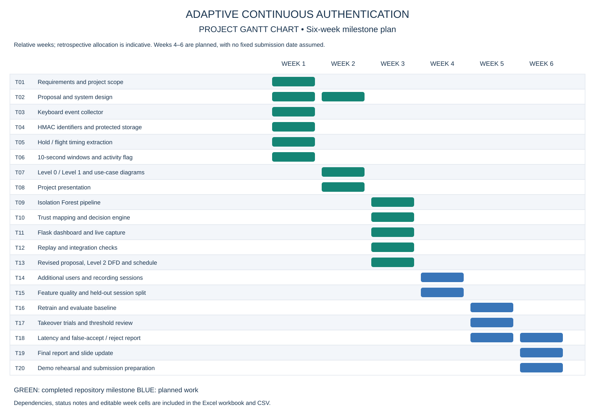

# Adaptive Continuous Authentication — Project Schedule

[Download the editable Excel Gantt chart](Adaptive_Continuous_Authentication_Gantt.xlsx) · [Task data (CSV)](gantt_tasks.csv) · [Full-size chart](Gantt_Chart.svg)

The chart covers 20 tasks across six relative weeks, following the current journal sequence. Weeks 1–3 summarize completed project milestones; their allocation is indicative rather than a verified calendar history. Weeks 4–6 cover planned collection, evaluation and final documentation. No submission date or unverified performance result is assumed.

The workbook includes task dependencies, status, editable start/end weeks, a formula-driven timeline, and a Notes sheet. Green means completed; blue means planned. Change the week numbers (1–6) and use `Completed` or `Planned` in the status column to update the timeline in Excel. Dependencies document sequencing but do not automatically reschedule tasks.

The SVG and CSV are static exports. Edit the task list in [the generator](../tools/generate_gantt.py) and rerun it to regenerate all formats consistently. Regeneration overwrites workbook edits.

The [reference repository](https://github.com/NamanArora2709/ucs503p-202627-privalens) lists an Excel Gantt chart. Its workbook was unavailable to inspect, so this schedule uses this project's own milestones and remaining work.
